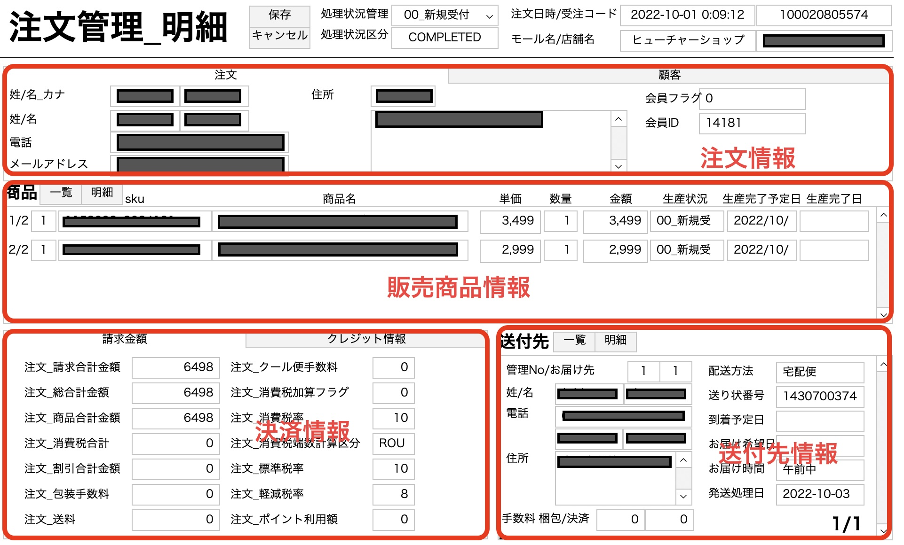

# FileMaker Order Core

FileMaker を用いた受注管理システムの **基盤構成**を切り出したリポジトリです。  
複数モールから取得した受注データを正規化し、運用しやすい形に整理する仕組みを公開しています。

---

## 🚀 機能概要

各モールから取得した受注データ（購入者・送付先・商品情報が混在）を  
取り込み処理にて **複数テーブルへ分割して保存**します。

また、今後のチャネル拡大を見据え、以下の改善を行っています。

---

## 🖼 画面イメージ

### ■ 注文一覧画面

### ■ 注文詳細画面

---

- ✅ **分離モデルを採用**  
  D（データベース）、M（マスタ）、I（インターフェース）構成により保守性・拡張性を向上
- ✅ **取り込み処理を2フェーズ化**
  | フェーズ | 内容 |
  |--------|------|
  | チャンネル依存処理 | 各モール固有の項目変換・データ整形 |
  | 共通取込処理 | 標準化されたデータを FileMakerDB に保存 |

構造をシンプルに保ちつつ、 **将来的な基幹システム化を想定した設計**です。

---

## 📂 ディレクトリ構成

| パス | 内容 |
|------|------|
| `/src/fm` | FileMaker の D/M/I 分離モデルで構成されたデータファイル |
| `/src/data` | futureshop の注文データ取り込みサンプル |

---ß

## 🧱 FileMaker 分離モデル構成

| モジュール | 名前 | 役割 |
|----------|------|------|
| D | Database | データ保持（永続化） |
| M | Master | 各種マスタ情報 |
| I | Interface | 運用画面・レイアウト・スクリプト |

> 現場での運用改善や機能追加に強く、影響範囲を最小化できます。

---

## 🔄 受注取り込みフロー（概要）

---

## 📥 取込処理の実行方法

本リポジトリに含まれる FileMaker インターフェースファイル  
`src/fm/I_取込_futureshop.fmp12` を開き、  
以下のスクリプトを実行してください：

- **スクリプト名：受注取込**

外部モールデータ（例：`/src/data` 配下のサンプル）を読み込み、  
チャンネル依存処理 → 共通取込処理 → テーブル格納 の流れで処理が実行されます。

---

## 📄 取り込みデータ仕様（futureshop CSV）

取り込み対象の受注データは **futureshop形式の CSV** です。  
ダウンロード時の仕様や列構成については以下を参照してください：

- 仕様ページ：[受注データ（futureshop形式）](https://manual.future-shop.jp/regist/ordershippingdata/futureshopCSV)

**ポイント**
- 処理は２０２３年時のものです。
- CSV の文字コードは **Shift_JIS** です。
- 列構成は futureshop の公式仕様に準拠しています。
- 取り込み時には、必須項目のチェック・文字コードの変換・日付・数値の正規化を行ってください。
- 実運用では仕様変更に備え、定期的な確認が推奨されます。

---

## 🧑‍💻 作者

**Ryohma U.**  
ポートフォリオ：[https://www.rnsystem.jp](https://www.rnsystem.jp)

---

> 💡 **補足**  
> このコードは教育・学習目的で公開しています。  
> 実際の業務環境で運用する際は、各事業者の運用ルールやデータ構造に合わせて
> 必ずテーブル設計・レイアウト構成・スクリプト処理を調整してください。
> また、公開・共有を行う場合は、セキュリティ対策やアクセス権限設定など
> 適切な保護措置を十分に講じていただくようお願いします。ß